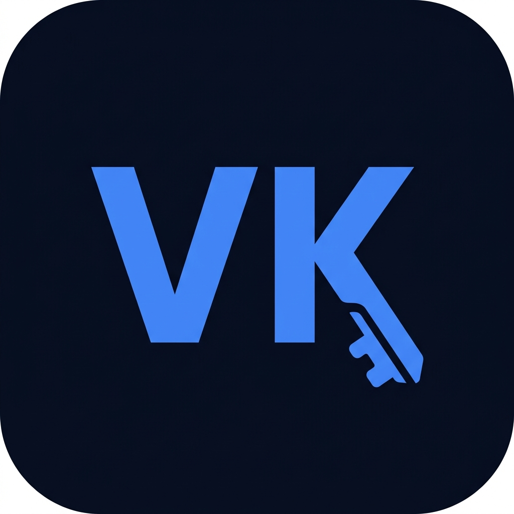

<div align="center">



# VaultKey

**Zero-Trust. 100% Offline. Uncompromising Security.**

A premium, open-source password manager for Android — built with React Native & Expo. Your data never leaves your device.

[](./app.json)
[](.)
[](.)
[](https://expo.dev)
[](.)

</div>

---

## 🔐 What is VaultKey?

VaultKey was engineered to solve a fundamental problem in modern password management: **the reliance on cloud infrastructure**. Cloud-based password managers are frequent targets for data breaches.

VaultKey's answer is simple — **your data never touches a server. Ever.**

| Principle | Description |
|---|---|
| 🚫 **No Network Calls** | Zero telemetry, zero cloud sync, zero external API dependencies |
| 🔒 **Total Data Ownership** | Data never leaves the device unless you explicitly export an encrypted `.pnb` backup |
| ✨ **Premium Aesthetics** | A modern, fluid, glassmorphic UI that rivals enterprise-grade applications |

---

## ✨ Features

### 🗝️ Password Vault
- Displays all credentials with a visual **Password Strength Ring** (Red → Yellow → Green → Blue)
- Smart `SiteIcon` component: fetches real favicons for known domains, falls back to a generated initial
- Sort, filter, search, and mark items as **favorites**

### 📝 Secure Notes
- Store freeform encrypted text — recovery phrases, banking PINs, private thoughts
- Uses the same **AES-256-GCM** pipeline as password entries

### 🔑 TOTP Authenticator (Built-in 2FA)
- Fully native, **100% offline** Time-based One-Time Password engine
- Scan QR codes via camera or enter a **Base32 secret key** manually
- 30-second countdown timer with a visual progress bar that flashes red on expiry

### 🎲 Password Generator
- Toggle **Uppercase, Lowercase, Numbers, Symbols** independently
- Adjustable length slider
- Powered by `expo-crypto` random bytes for cryptographically secure output

### 💾 Backup & Restore (`.pnb`)
- Proprietary **Portable Network Backup** format with embedded PBKDF2 salt
- **Auto-Backup** via Android's Storage Access Framework (SAF) — triggers on every vault change
- **Smart Import/Merge** — skips duplicate entries, supports re-encryption across different master passwords

---

## 🛡️ Security Architecture

### Master Key Derivation
```
Master Password + Unique Salt ──► PBKDF2 ──► AES-256 Session Key (in-memory only)
```
- The derived key is **never stored to disk**. It lives in a volatile session variable and is wiped on lock or close.

### Data Encryption
- Every sensitive field (`username`, `password`, `totp_secret`, `notes`, `url`) is encrypted with **AES-256-GCM** *before* being written to SQLite.
- The raw database contains only base64-encoded ciphertext — completely unreadable without the session key.

### Authentication Options
| Method | Description |
|---|---|
| **Master Password** | Full PBKDF2-derived key authentication |
| **4-Digit PIN** | Hashed PIN for quick daily access |
| **Biometrics** | FaceID / Fingerprint — retrieves the session state without re-entering the master password |

---

## 🏗️ Tech Stack

| Layer | Technology |
|---|---|
| **Framework** | React Native 0.81 + Expo SDK 54 |
| **Language** | TypeScript 5.9 |
| **Navigation** | React Navigation v7 |
| **Database** | `expo-sqlite` (local SQLite) |
| **Cryptography** | `@noble/ciphers` (AES-256-GCM) + `@noble/hashes` (PBKDF2) |
| **Biometrics** | `expo-local-authentication` |
| **Camera / QR** | `expo-camera` |
| **Secure Storage** | `expo-secure-store` |
| **Build** | EAS Build (Expo Application Services) |

---

## 🗄️ Database Schema

### `settings` table
Stores app-wide configuration.

| Column | Description |
|---|---|
| `master_password` | Hashed master password (for verification) |
| `master_password_meta` | PBKDF2 salt (critical for backup decryption) |
| `pin_hash` | Hashed 4-digit PIN |
| `use_biometrics` | Biometric unlock toggle |
| `auto_backup` | Auto-backup enabled flag |
| `backup_uri` | SAF URI for the auto-backup folder |

### `vaults` table
Primary data store for all entry types (Passwords, Notes, Authenticators).

| Column | Notes |
|---|---|
| `id` | Primary key |
| `site_name` | Plaintext — used for search & indexing |
| `username` | **Encrypted** |
| `encrypted_password` | **Encrypted** |
| `totp_secret` | **Encrypted** |
| `notes` | **Encrypted** |
| `url` | **Encrypted** |
| `is_note` | Boolean flag |
| `is_favorite` | Boolean flag |
| `created_at` / `updated_at` | Timestamps |
| `deleted_at` | Soft-delete (enables trash recovery & clean backup merges) |

---

## 💾 The `.pnb` Backup Format

Because VaultKey has no cloud sync, backups are your **lifeline against device loss**.

```json
{
  "version": 2,
  "master_meta": "<original_PBKDF2_salt>",
  "entries": [
    {
      "site_name": "GitHub",
      "username": "<AES-256-GCM encrypted>",
      "encrypted_password": "<AES-256-GCM encrypted>",
      ...
    }
  ]
}
```

**Why embed the salt?** When you install VaultKey on a new phone, a *new* salt is generated. Without the original salt, your old Master Password produces a completely different AES-256 key — locking you out of your backup permanently. Embedding the salt solves this.

### Auto-Backup Behavior
1. User grants folder access via Android SAF once
2. Every vault modification (add/edit/delete) silently writes a new `.pnb` to that folder
3. Previous `VaultKey_AutoBackup` files in that folder are **automatically deleted** to prevent storage bloat

### Smart Import / Merge
- Skips **duplicate entries** already in the active vault
- **Re-encrypts** all imported data with the current session key if the backup was made under a different master password

---

## 🚀 Getting Started (Development)

### Prerequisites
- Node.js ≥ 18
- Expo CLI: `npm install -g expo-cli`
- Android Studio (for emulator) or a physical Android device with **Developer Mode** enabled

### Installation

```bash
# 1. Clone the repository
git clone https://github.com/Siddhantpal08/VaultKey.git
cd VaultKey

# 2. Install dependencies
npm install

# 3. Start the Expo dev server
npm start

# 4. Run on Android
npm run android
```

### Build APK (Production)

```bash
# Requires EAS CLI: npm install -g eas-cli
eas build --platform android --profile production
```

---

## 🌐 Marketing Website

A companion landing page (`website/`) is built with **HTML, CSS, and vanilla JS**, featuring:

- **Dark Cyber Aesthetic** — deep space background with indigo/blue gradient diffusion
- **3D Hero Element** — pure CSS `perspective` + `preserve-3d` rotating card (Shield → Key)
- **CSS Animations** — `animate-pulse-glow`, `animate-float`, slide-in toast notifications
- **Smart Download Flow**:
  - 📱 **Mobile** → APK download triggers instantly with a glassmorphic toast confirmation
  - 🖥️ **Desktop** → QR code modal appears for easy phone-side scanning, with a fallback direct link

---

## 🎨 UI/UX Design System

- **Theming:** `ThemeContext` + `useStyles()` hook — live Light/Dark switching without app restarts
- **Dark Mode:** `#060B17` deep background with glowing surface borders
- **Navigation:** Custom `BottomTabBar.tsx` with pill-shaped active-glow indicators
- **Modals:** Glassmorphic React Native overlays (not OS defaults) for brand consistency
- **FABs:** Floating Action Buttons positioned to respect safe areas and the tab bar height

---

## 📁 Project Structure

```
VaultKey/
├── src/                    # Core application source
│   ├── screens/            # App screens (Home, Notes, TOTP, Generator, Settings)
│   ├── components/         # Reusable UI components
│   ├── context/            # ThemeContext, AuthContext
│   ├── db/                 # SQLite database setup & migrations
│   └── utils/              # crypto.ts, backup engine, TOTP logic
├── assets/                 # Icons, splash screen, fonts
├── website/                # Companion marketing website
├── android/                # Native Android project files
├── app.json                # Expo app configuration
└── eas.json                # EAS Build profiles
```

---

## ⚠️ Security Disclaimer

VaultKey is a **local-first** application. All security guarantees depend on:
1. The strength of your **Master Password** — use a long, unique passphrase.
2. The physical security of your device.
3. Keeping your `.pnb` backup files in a safe, private location.

> **The developers cannot recover your data if you forget your Master Password.** There is no reset mechanism by design.

---

<div align="center">

Built with ❤️ by [Siddhant Pal](https://github.com/Siddhantpal08)

*VaultKey — Because your passwords deserve better than a cloud.*

</div>
